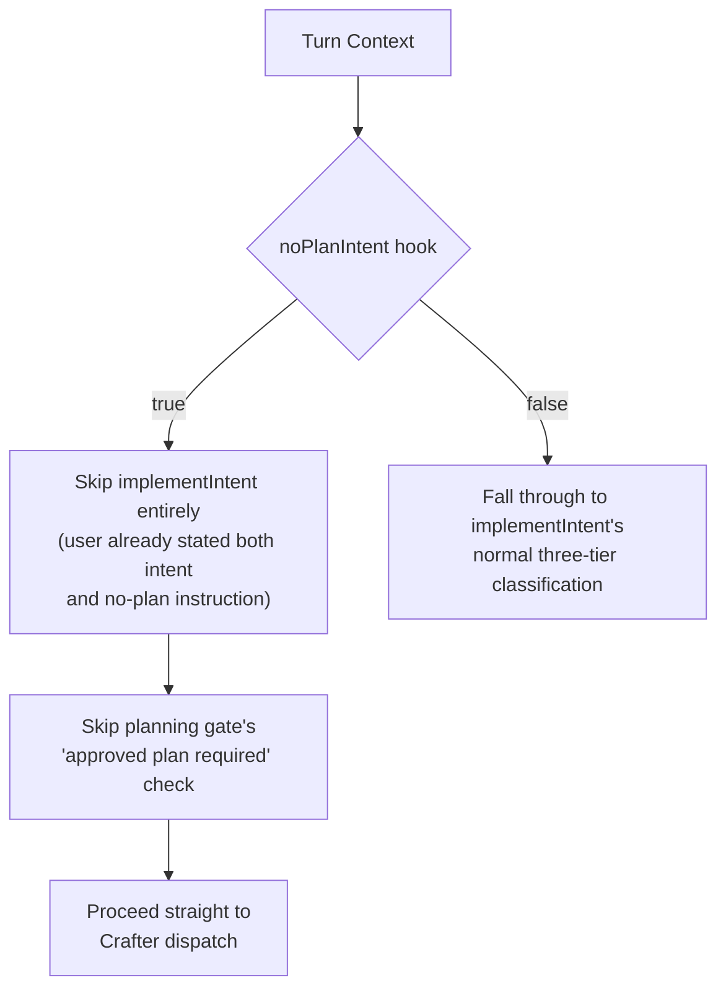
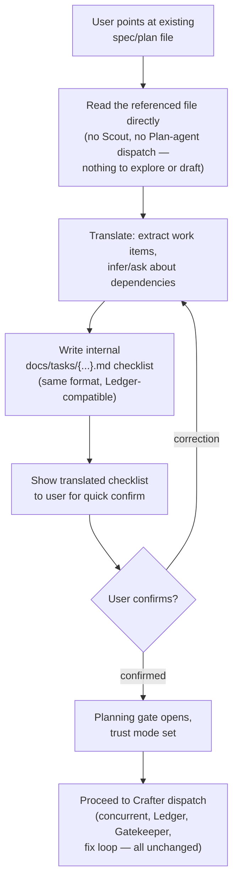
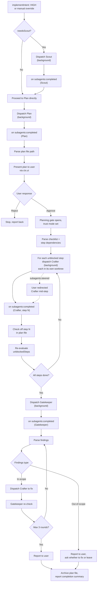

# Roadmap — pi-party (fork of @tintinweb/pi-subagents)

> Forked from `@tintinweb/pi-subagents` v0.12.0. This roadmap covers the transformation from a general-purpose subagent spawner into a purpose-built orchestration extension with a structured explore→plan→build→verify pipeline.
>
> **Relationship to `/summoner`**: pi-party is the same core idea as the `/summoner` PRD (v3) — ambient triggering, Scout/Crafter/Gatekeeper roles, plan files, ledger, mid-run steering — built as a fork of `tintinweb/pi-subagents` instead of from scratch. The `/summoner` docs are not superseded or deleted; they remain the idea archive for a possible from-scratch build later. Where this doc and `/summoner`'s v3 docs differ, it is purely implementation (built on tintinweb's spawn/widget/steering infrastructure instead of bespoke RPC+tmux), not a change in product intent.
>
> **Revision note (this version):** three decisions from the original draft have been reversed after review — see "Decisions reversed from v1 draft" below. The affected sections (Trigger paths, Crafter phase, pipeline execution model) are rewritten accordingly; everything else is unchanged from the original roadmap.

---

## Decisions reversed from v1 draft

| Area | v1 draft said | Now | Why |
|---|---|---|---|
| **Ambient trigger** | Prompt-guided — main agent's system prompt instructs it to recognize implement-intent from conversation | A real hook, evaluated every turn, independent of the main agent's own context | Prompt-only guidance can degrade or get compacted out of context over a long conversation — it's not actually durable. A hook doesn't share that failure mode. Same reasoning that justified the structural planning gate elsewhere in this design; leaving the trigger soft while the gate is hard was an inconsistency. |
| **Worktree isolation** | Removed — "Crafters work in main repo; plan files track changes," assumed sequential-only execution | Kept | Confirmed in practice: `pi-subagents` can spawn two Crafter-type agents concurrently, both writing code. Plan files track step order, not write concurrency — they don't prevent two simultaneous writers from clobbering each other. Sequential-only was never actually guaranteed, so the isolation removal assumed a guarantee that doesn't hold. |
| **Pipeline execution** | Foreground, synchronous `Orchestrate` tool — one blocking call runs the whole pipeline | Background, event-driven — phases run as real background agents; orchestration logic reacts to lifecycle events | A blocking call has no "mid-run" to steer into and no way for the main agent to field a side-question (`/btw`) while a phase runs — both of which are explicit, valued features (mid-run steering is one of the reasons tintinweb was chosen as the fork base over the alternatives). Foreground-blocking made both structurally impossible, not just costly. |

---

## Vision

Transform pi-subagents into **pi-party**: a pi extension that doesn't just spawn agents on demand, but runs a structured pipeline — **Scout → Plan → Crafter → Gatekeeper** — for implementation tasks, while keeping the existing subagent infrastructure (background execution, live widget, mid-run steering, worktree isolation) for general use and as the actual mechanism the pipeline runs on.

The main agent interacts with the codebase through **Scout** by default for any codebase question, handles file-tree/structure and document lookups (markdown, `package.json`, config files) directly without Scout, and triggers the planning flow when a dedicated hook detects implementation intent in the conversation — independently of whether Scout has fired or not.

---

## Agent lineup

### New & modified default agents

| Agent | Tools | Model | Prompt mode | Role |
|---|---|---|---|---|
| **Scout** | read, grep, find, ls, bash | haiku (fallback: inherit) | replace | Codebase explorer. Returns minimal, precise slices — file paths, dependency maps, symbol locations. Fires whenever Main Agent needs codebase info, with no restriction on timing — independent of implement-intent, mid-task, side-question, anytime. |
| **Plan** | read, grep, find, ls, bash | inherit | replace | Pipeline architect. Writes structured plan files to `docs/tasks/`. Output: goal, non-goals, approach, ordered checklist with explicit step dependencies (see Plan file format). Replaces the old Plan agent entirely. |
| **Crafter** | all | inherit | replace | Implementation agent. Executes one checklist step at a time per instance — but **multiple Crafter instances may run concurrently** on independent steps, each isolated in its own worktree (see Worktree isolation). Reports what files changed and why. Follows existing patterns. |
| **Gatekeeper** | read, bash, grep, find, ls | inherit | replace | QA & review agent. Runs test suite, verifies implementation matches plan, reviews code quality. Read-only — no write/edit tools (architecturally enforced). Classifies issues as in-scope (auto-fix via Crafter) or out-of-scope (ask user). |
| **general-purpose** | all | inherit | append | Kept unchanged. Parent twin for catch-all tasks outside the pipeline. |

### Removed agents

| Agent | Reason |
|---|---|
| **Explore** | Replaced by Scout. Same tool set, but Scout has a broader role and proactive posture. |
| **Plan (old)** | Replaced by pipeline-aware Plan that writes plan files. |

### Custom agents

Custom agent definitions (`.pi/agents/*.md` with YAML frontmatter) remain fully supported and unchanged. Users can define additional agents alongside the built-in pipeline agents.

---

## Trigger paths — ambient hooks (revised)

Two independent checks, run by a dedicated hook on every relevant turn — not prompt guidance, not inferred from the main agent's own judgment in the moment. Neither check depends on the other's result.

### `needsScout` — codebase-info check

- Binary: does answering or proceeding right now require codebase knowledge Main Agent doesn't already have.
- No restriction on timing — fires mid-discussion, mid-task, after a prior task finished, via a side-question, regardless of what else is in flight.
- Explicitly excludes file-tree/structure lookups and document files (`*.md`, `package.json`, config files) — Main Agent handles those directly, never via Scout.
- On a hit, Scout is dispatched as a background agent immediately — no approval gate, since Scout is read-only and low-risk.

### `implementIntent` — three-tier classification

- **High** → trigger the plan flow directly: dispatch Scout first if `needsScout` also fired (independently — see above), then Plan.
- **Medium** → don't assume either way. Surface a direct check to the user ("Want me to put together a plan for that?") and wait for their next message to decide. Does not block or delay Scout — Scout's own check is independent and may fire regardless of this tier.
- **Low** → no plan flow triggered. Normal conversation continues; Scout may still fire per its own independent check.

### Manual override

`/summoner <task>` (or `/pipeline`/`/implement` — naming TBD) remains available, forcing the plan flow to start regardless of what the ambient hook decided. Same downstream flow either way; only the trigger differs.

### `noPlanIntent` — explicit no-plan signal, checked before `implementIntent`

A third independent hook, checked first: did the user explicitly say not to plan this — e.g. "I found a bug, update the logic to do X, no need to plan, just implement it directly." Binary, narrow, and deliberately conservative: it detects an *explicit* statement that planning should be skipped, not casualness or brevity of phrasing. "Just fix it" with no skip-planning language is not itself a signal; the hook should never infer intent-to-skip from tone alone, only from language that actually says so.



No separate flag (e.g. `--skip-plan`) exists alongside this — a single mechanism for one outcome, added back later only if a deterministic shortcut turns out to be worth the extra surface.

**Neither outcome affects `needsScout`.** Scout's check is independent of `noPlanIntent`, `implementIntent`, and the planning gate; a plan-skipped task can still trigger Scout if Crafter genuinely needs to locate something first. Skipping the plan doesn't mean skipping all codebase awareness.

### Why a hook, not a prompt

A system prompt instruction is contextual guidance the main agent is supposed to remember and apply in the moment — it shares the main agent's context window, and long conversations get compacted/summarized, which can silently thin out or deprioritize instructions that aren't being actively reinforced. A hook is code that runs independently every turn; it has no compaction failure mode. The planning gate (see below) is already a structural, code-level check rather than a prompt nudge — leaving the trigger as prompt-only would be inconsistent with that choice and reintroduce the exact soft-enforcement gap the gate exists to close.

---

## Adapting an existing user-authored plan (spec-driven development)

A user practicing spec-driven development (openspec-style, or any other convention) may already have a plan written in their own format before pi-party is ever invoked. This is distinct from `findExisting`'s original case (re-loading a plan pi-party itself wrote in an earlier session) — here the plan was never pi-party's to begin with, and almost certainly isn't in the internal checklist/dependency format the orchestrator dispatches against.

The internal plan-file format isn't optional in this case — it's still required, because the orchestrator's dispatch logic (`unblockedSteps`, the Ledger's pre-dispatch check, per-step checking-off) is code reading a specific shape, not something that can operate on an arbitrary user document directly. What changes is *what gets skipped*, not whether an internal plan exists at all.

### Trigger

Detected only when the user explicitly points at the file (e.g. "use the plan in `specs/auth.md`") — **not** auto-discovered. Pi-party does not scan the project for spec-shaped files unprompted; this keeps detection simple and avoids guessing wrong about what counts as a plan.

### Flow



### Why a confirm step survives even though the user already approved the plan

The plan's *content* was already approved by the user when they wrote it — but the *translation* into the internal checklist is pi-party's own interpretive step, and that step can misread intent (wrong step boundaries, missed or incorrect dependency inference, scope drift). The confirm is scoped to catching that, not to re-litigating whether the plan itself is a good idea.

---

## The planning gate (structural enforcement)

Carried over unchanged in intent from the original `/summoner` PRD's hard constraint ("never summon Crafter without a plan existing first"), now implemented as actual interception rather than asserted as a rule the orchestrator's own logic is trusted to follow:

- The `Agent` tool call is intercepted. If the resolved `subagent_type` has `write`/`edit` in its tool set, and no completed, user-approved plan exists yet for this task, the spawn is rejected with a message directing the orchestrator to run Plan first.
- "Approved" mirrors the strict shape used elsewhere in the ecosystem (e.g. `pi-quest`'s `planningMode: "approve"`): plan exists → shown to the user → explicit approval → only then does the gate open for that task's Crafter spawns.
- **Trivial-task bypass — resolved: user-explicit only, via `noPlanIntent`.** The gate is hard-on by default with no exceptions; the *only* way to skip it is the user explicitly saying so in their own words, detected by the `noPlanIntent` hook (see Trigger paths above) — not a separate flag, not orchestrator self-declaration. The hook is deliberately conservative: it fires only on an explicit no-plan statement, never inferred from casual or brief phrasing. Judgment about what doesn't need a structural check stays with a human, not with the thing the check exists to constrain. The bypass short-circuits `implementIntent` classification and this gate only — `needsScout` is untouched and may still fire; a plan-skipped task can still need Scout to locate the right place to edit.

---

## Pipeline execution model — background, event-driven (revised)

The original draft's single blocking `Orchestrate` tool call is replaced. Each phase is dispatched as a real **background** tintinweb agent; the orchestration logic is a set of event listeners reacting to lifecycle events (`subagents:created`, `started`, `completed`, `failed`, `steered`), not a synchronous function blocking on each phase in turn.

### Why background, not foreground

A blocking foreground call has no "mid-run" for the user to steer into, and no way for Main Agent to field a side-question while a phase is running — both are explicit, valued capabilities (mid-run steering specifically was a stated reason for choosing tintinweb as the fork base over alternatives). Foreground execution doesn't just cost convenience here; it makes steering and side-questions structurally impossible, since Main Agent itself is the thing blocked on the call.

### Flow (event-driven, not sequential function calls)



While any of the above is in flight, Main Agent remains free to: respond to side-questions (`/btw`-style), dispatch Scout for an unrelated need, or relay a user's steer into a running Crafter/Gatekeeper. None of this waits on pipeline completion.

### Scout standalone

Unchanged — Scout is also callable standalone via the existing `Agent` tool, independent of the pipeline, for any codebase question that doesn't carry implement-intent.

---

## Worktree isolation (retained)

**Reversed from the v1 draft's removal.** Multiple Crafter instances may run concurrently on independent plan steps (steps with no dependency relationship). Without isolation, concurrent writers in the same working tree risk silently clobbering each other's changes, spurious conflicts on shared files (lockfiles, config), or one Crafter reading another's transiently broken mid-edit state. None of this is hypothetical — confirmed in practice with `pi-subagents` spawning two concurrent code-writing agents.

- Each concurrently-dispatched Crafter gets its own worktree on its own branch.
- Merge happens once each Crafter's step completes — either into a shared pipeline branch or sequentially into the main working branch, with conflict handling TBD (see open questions).
- Sequential-only execution (one Crafter at a time, always) remains a valid simpler starting point for Phase 1 if preferred — worktree plumbing stays available either way so concurrent execution can be turned on later without restructuring.

---

## Plan file format

Plan files are written to `docs/tasks/{timestamp}-{short-title}.md`.

### Template

```markdown
# {Task Title}

**Created**: {timestamp}
**Status**: in-progress

## Goal
{What we're building — one paragraph}

## Non-goals
{What we're explicitly NOT doing}
- ...
- ...

## Approach
{How we'll implement it — architecture decisions, patterns to follow, key files}
...

## Checklist
- [ ] Create auth middleware {#auth-middleware}
- [ ] Add input validation helper {#input-validation}
- [x] Wire middleware into routes (depends on: auth-middleware, input-validation)
```

**Step-dependency syntax — resolved: label-based.** Each step carries a stable short slug (`{#slug}`), and dependency references point at those slugs rather than positional numbers. This is resilient to a plan being revised or reordered later — an LLM editing a checklist across revisions is far more likely to insert or reorder steps than a human carefully hand-maintaining indices, and index references would silently drift out of sync with what they were meant to point at the moment that happens. Labels avoid that failure mode entirely, at the small cost of Plan needing to mint a slug per step when writing the file.

### Operations

| Function | Description |
|---|---|
| `writePlan(task, title, content)` | Write new plan file, return path |
| `readPlan(path)` | Read plan file as string |
| `checkOffStep(path, slug)` | Mark the step identified by `slug` as `[x]` |
| `findExisting(task)` | Scan `docs/tasks/` for a matching plan |
| `archive(path)` | Move to `docs/tasks/archived/` |
| `unblockedSteps(path)` | Return steps whose dependency slugs are all checked off — drives concurrent Crafter dispatch |

---

## The Ledger (reinstated as load-bearing)

The original `/summoner` PRD scoped this as "no conflict-detection logic needed for v1 (sequential-only), but the shape is chosen so parallel support could be added later." With concurrent Crafters now confirmed as real rather than hypothetical, that later point is now — the Ledger needs to actually do conflict-checking, not just record history for posterity.

- Shape unchanged: `{file, agent, action, timestamp}`.
- Updated after every agent report-back, consulted **before** dispatching a new Crafter — if a file a candidate step would touch is already claimed by an in-flight Crafter, that step waits even if its plan-file dependencies are satisfied.
- Owned solely by the orchestrator; no agent instance holds its own conflicting view.

---

## Status widget

A persistent widget showing pipeline progress, replacing or augmenting the existing agent activity widget. Updated to reflect that multiple Crafters may be active at once, not a strict single-file progression:

```
🟢 Scout       Exploring auth module structure…
✅ Scout       Found 12 relevant files
🟢 Plan        Drafting implementation plan…
✅ Plan        Plan written: docs/tasks/2026-06-29-jwt-auth.md
🟢 Crafter-1   Step 1/4: Create middleware file
🟢 Crafter-2   Step 2/4: Add tests (independent of step 1, running concurrently)
🟡 Crafter     Step 3/4: Apply to route files (queued — depends on step 1)
🟡 Gatekeeper  Waiting…
```

States: 🟢 working, 🟡 queued/waiting, ✅ done, ❌ failed.

---

## Features stripped from pi-subagents

| Feature | Files removed | Reason |
|---|---|---|
| **Scheduling** | `schedule.ts`, `schedule-store.ts`, `ui/schedule-menu.ts` | Pipeline is explicitly invoked (ambient hook or manual override), not cron-driven |
| **Model scope enforcement** | `enabled-models.ts` | Not needed for this scope |

### Parameter removals from Agent tool

- `schedule` param (was gated on `schedulingEnabled`)
- Settings menu entries for scheduling, scope models

> **Note:** worktree isolation (`worktree.ts`) and its `isolation` param are **no longer in this removal list** — see "Worktree isolation (retained)" above. This reverses the v1 draft.

---

## Features kept from pi-subagents

| Feature | Rationale |
|---|---|
| Custom agents (`.pi/agents/*.md`) | Users define additional agent types alongside pipeline agents |
| Parallel background agents + concurrency queue | Multiple agents can run concurrently; queue respects `maxConcurrent` — now load-bearing for concurrent Crafters, not just incidental |
| Git worktree isolation | Load-bearing for concurrent Crafters — see above. Reversed from v1 draft's removal. |
| Live widget UI + FleetView | Above-editor widget with spinners, token counts; Claude Code-style navigable agent list below editor |
| Conversation viewer + mid-run steering | Scroll through agent transcripts; inject messages into running agents — the specific capability that ruled out a foreground/blocking pipeline design |
| Cross-extension RPC | Other extensions can spawn/stop subagents via event bus — also the mechanism the orchestrator's own event-driven flow is built on |
| Session resume | Continue a previous agent's work preserving full context |
| Graceful turn limits | Agents get wrap-up warning before hard abort |
| Persistent agent memory | `memory: user/project/local` scopes with read-only fallback |
| Skill preloading | Inject named skills into agent system prompts |
| Tool denylist | `disallowed_tools` frontmatter |
| Custom tool descriptions | `toolDescriptionMode`: full/compact/custom |
| Group join / smart join | Consolidated notifications for parallel background agents |
| Conversation logging | `.pi/output/agent-<id>.jsonl` transcripts |
| Agent lifecycle events | `subagents:created/started/completed/failed/steered/compacted` — now the actual backbone of the orchestrator, not just an audit trail |

---

## Implementation milestones

### Milestone 1: Agent definitions (small, low risk)

**Goal**: New agent types available for spawning via existing `Agent` tool.

**Tasks**:
- [ ] Replace `Explore` with `Scout` in `default-agents.ts`
- [ ] Replace old `Plan` with pipeline-aware `Plan` in `default-agents.ts`
- [ ] Add `Crafter` agent definition to `default-agents.ts`
- [ ] Add `Gatekeeper` agent definition to `default-agents.ts`
- [ ] Update `DEFAULT_AGENT_NAMES` constant
- [ ] Write system prompts for each new agent
- [ ] Test: spawn each new agent type via `Agent` tool

**Files**: `src/default-agents.ts`, `src/prompts.ts`

---

### Milestone 2: Plan file module (small, self-contained)

**Goal**: Module for writing, reading, checking off, archiving, and dependency-querying plan files.

**Tasks**:
- [ ] Create `src/plan-file.ts`
- [ ] Implement `writePlan(task, title, content)` → `string` (file path)
- [ ] Implement `readPlan(path)` → `string`
- [ ] Implement `checkOffStep(path, slug)` → `void`
- [ ] Implement `findExisting(task)` → `string | null`
- [ ] Implement `archive(path)` → `void`
- [ ] Implement `unblockedSteps(path)` → `string[]` — slugs of steps whose dependency slugs are all satisfied, drives concurrent Crafter dispatch
- [ ] Implement `translateExternalSpec(path)` → internal checklist content — reads a user-pointed-to spec/plan file and extracts work items + inferred dependencies into the same format `writePlan` produces, for the spec-driven-development adaptation path (skips Plan-agent drafting, not the internal-format requirement)
- [ ] Implement label-based dependency parsing (`{#slug}` step identifiers, `depends on: slug, slug`) for checklist steps
- [ ] Ensure `docs/tasks/` and `docs/tasks/archived/` directories are created on demand
- [ ] Unit tests for all operations, including dependency parsing

**Files**: `src/plan-file.ts`, `test/plan-file.test.ts`

---

### Milestone 3: Trigger hook (small, self-contained)

**Goal**: Independent, code-level evaluation of `needsScout` and three-tier `implementIntent`, run every relevant turn — not prompt guidance.

**Tasks**:
- [ ] Create `src/trigger.ts`
- [ ] Implement `needsScout(turnContext)` → `boolean`, excluding file-tree/structure and document-file (`*.md`, `package.json`, config) lookups
- [ ] Implement `noPlanIntent(turnContext)` → `boolean` — explicit no-plan signal only, checked before `implementIntent`; deliberately conservative, never inferred from casual/brief phrasing
- [ ] Implement `implementIntent(turnContext)` → `"high" | "medium" | "low"`, only reached when `noPlanIntent` returns false
- [ ] Wire both checks to fire on every relevant turn (confirm exact hook name against the live `ExtensionAPI` event list)
- [ ] Decide and implement medium-tier UX: surfaced question to the user, awaiting their next message
- [ ] Decide cost/model profile for the hook itself — should be cheap/fast, separate from whichever model runs Scout/Plan/Crafter
- [ ] Unit tests with representative conversation snippets per tier

**Files**: `src/trigger.ts`, `test/trigger.test.ts`

---

### Milestone 4: Planning gate (small, self-contained)

**Goal**: Structural interception of the `Agent` tool call — no write-capable spawn without an approved plan for that task.

**Tasks**:
- [ ] Create `src/planning-gate.ts`
- [ ] Implement the interception point ahead of `Agent` tool execution
- [ ] Check resolved `subagent_type`'s tool set for `write`/`edit`
- [ ] Check for an existing, user-approved plan covering this task
- [ ] Reject with a clear message directing the orchestrator to Plan first, when ungated
- [ ] Wire the gate to skip the plan-required check when `noPlanIntent` returned true for this task — no separate flag, no orchestrator self-declaration path, no heuristic
- [ ] Unit tests covering: no plan, unapproved plan, approved plan, `noPlanIntent`-triggered bypass

**Files**: `src/planning-gate.ts`, `test/planning-gate.test.ts`

---

### Milestone 5: Ledger module (small, self-contained)

**Goal**: File-level conflict tracking, now load-bearing for concurrent Crafter dispatch.

**Tasks**:
- [ ] Create `src/ledger.ts`
- [ ] Implement entry shape `{file, agent, action, timestamp}` and append/query operations
- [ ] Implement the pre-dispatch check: does an unblocked step's file set overlap with any in-flight Crafter's claimed files
- [ ] Decide persistence: in-memory only for the run, or also written via `pi.appendEntry` for resume-after-interruption (open question, carried from `/summoner` v3)
- [ ] Unit tests for conflict detection and the held-back-until-clear case

**Files**: `src/ledger.ts`, `test/ledger.test.ts`

---

### Milestone 6: Event-driven orchestrator (core, highest risk)

**Goal**: The orchestration logic that reacts to `subagents:*` lifecycle events to drive Scout → Plan → approval → concurrent-aware Crafter dispatch → Gatekeeper → fix loop, without any single blocking call.

**Tasks**:
- [ ] Create `src/orchestrator.ts`
- [ ] Register listeners for `subagents:created/started/completed/failed/steered/compacted`
- [ ] On `implementIntent: high` (or medium + user confirmation, or manual override): begin the flow
- [ ] Scout dispatch (background), gated independently by `needsScout`, not by `implementIntent`
- [ ] Plan dispatch (background) on Scout completion (or directly, if Scout wasn't needed)
- [ ] Approval UI (`ctx.ui`) on Plan completion — sets trust mode for the task, opens the planning gate
- [ ] Crafter dispatch logic: query `unblockedSteps`, cross-check against the Ledger, dispatch one background Crafter per clear, unblocked step — supporting more than one concurrently
- [ ] On Crafter `subagents:completed`: check off the step, release its Ledger claim, re-evaluate `unblockedSteps`
- [ ] On `subagents:steered`: do not assume prior understanding of that Crafter's state still holds once it next reports
- [ ] Gatekeeper dispatch (background) once all steps are done/skipped/failed
- [ ] Fix loop on Gatekeeper completion: in-scope → Crafter fix → Gatekeeper re-check (max 3 rounds); out-of-scope → ask user
- [ ] Archive plan file, report completion summary
- [ ] Confirm Main Agent remains free to respond to unrelated turns throughout — no global lock during a pipeline run
- [ ] Handle errors/failures at each phase without leaving the event-listener state inconsistent
- [ ] Widget updates at each phase/step transition, including concurrent Crafter rows
- [ ] Unit and integration tests, including a concurrent-Crafter scenario

**Files**: `src/orchestrator.ts`, `test/orchestrator.test.ts`

---

### Milestone 7: Wire into index.ts + strip features (integration)

**Goal**: Register hooks, the planning gate, the manual-override command, and remove the features actually being stripped.

**Tasks**:
- [ ] Register `trigger.ts`'s hook against the confirmed turn-level event
- [ ] Register `planning-gate.ts`'s interception ahead of `Agent` tool execution
- [ ] Register `/summoner <task>` (or `/pipeline`/`/implement` — naming TBD) as manual override, invoking the same orchestrator entry point as a high-confidence ambient trigger would
- [ ] Remove scheduling:
  - [ ] Delete `src/schedule.ts`, `src/schedule-store.ts`, `src/ui/schedule-menu.ts`
  - [ ] Remove `schedule` param from Agent tool schema
  - [ ] Remove scheduling settings menu entry
  - [ ] Remove scheduler initialization from `session_start`
  - [ ] Remove `scheduleParamShape`, `scheduleParam`, `scheduleGuideline` references
- [ ] Remove model scope enforcement:
  - [ ] Delete `src/enabled-models.ts`
  - [ ] Remove scope models settings menu entry
- [ ] **Do not remove** worktree isolation (`worktree.ts`, `isolation` param) — confirm it's wired into the new concurrent Crafter dispatch logic, not just left dormant
- [ ] Add pipeline status widget (separate or integrated into existing AgentWidget), reflecting concurrent Crafter rows
- [ ] Clean up unused imports and references across all files

**Files**: `src/index.ts`, `src/agent-manager.ts`, `src/ui/agent-widget.ts`

---

### Milestone 8: Tests + cleanup

**Goal**: Full test coverage for new modules, verify nothing broken from stripped features, verify concurrent-Crafter and steering scenarios work end to end.

**Tasks**:
- [ ] Unit tests for `plan-file.ts`, `trigger.ts`, `planning-gate.ts`, `ledger.ts`
- [ ] Unit tests for `orchestrator.ts` (mock AgentManager and event bus)
- [ ] Integration test: full pipeline, sequential steps only
- [ ] Integration test: full pipeline with two concurrent Crafters on independent steps
- [ ] Integration test: user steers a running Crafter mid-step; orchestrator picks up the change correctly afterward
- [ ] Integration test: `/btw`-style side question answered while a pipeline phase is in flight
- [ ] Verify existing tests still pass after removals
- [ ] Update `test/agent-widget.test.ts` for the concurrent-row display
- [ ] Update README and CHANGELOG
- [ ] Remove test files for stripped features only:
  - [ ] `test/schedule.test.ts`, `test/schedule-store.test.ts`, `test/schedule-e2e.test.ts`
  - [ ] `test/enabled-models.test.ts`
- [ ] **Do not remove** `test/worktree.test.ts` — extend it for the concurrent-Crafter case instead
- [ ] Update `package.json` scripts if needed
- [ ] Update `package.json` name/description for the fork

**Files**: `test/*`, `README.md`, `CHANGELOG.md`, `package.json`

---

## Risk assessment

| Risk | Impact | Mitigation |
|---|---|---|
| **Event-driven orchestrator complexity** | High — no single function to trace; state is spread across listeners reacting to async events | Each listener handles one event type with a narrow responsibility. Build and test Scout-only and Plan-only flows in isolation before wiring the full Crafter/Gatekeeper loop. |
| **Concurrent Crafter conflicts** | High — two writers in the same task, even with worktrees, need correct merge handling | Ledger pre-dispatch check prevents overlapping-file steps from running concurrently in the first place; worktrees handle the remaining case of independent-file concurrent writes. Define merge strategy explicitly before Milestone 6 ships. |
| **Trigger hook false positives/negatives** | Medium — wrong tier classification either nags the user unnecessarily or misses real implement-intent | Three-tier design with a medium "ask" tier specifically to avoid silently guessing wrong in either direction. Expect prompt/model iteration after real usage, per the hook's own test suite. |
| **Gatekeeper finding classification** | Medium — parsing in-scope vs out-of-scope from natural language output | Use structured output format in Gatekeeper's prompt. Fallback: treat all as ask-user. |
| **Plan parsing, including dependencies** | Medium — extracting checklist items and their dependency relationships from Plan's markdown output | Use a consistent, documented dependency syntax in the checklist format. Regex/structured parse, not free-text inference. |
| **Steering mid-Crafter consistency** | Medium — orchestrator's understanding of a step's state can go stale if the user steers a running Crafter | `subagents:steered` event explicitly re-syncs orchestrator state from that Crafter's next report, rather than trusting prior assumptions — same pattern as `/team`'s minion staleness check. |
| **Breaking existing Agent tool** | Low — changes are additive (new agents, new hooks, new gate) plus one retained feature (worktrees) that was never removed | Existing tests validate Agent tool behavior. |
| **Removing scheduling breaking cross-extension RPC** | Low — scheduling was not part of the RPC interface | Verify RPC handlers don't reference the removed scheduling module. |

---

## Open questions (for later)

- **Trivial-task bypass for the planning gate** — still undecided: user-explicit flag, orchestrator self-declares, or a heuristic (e.g. task description length). Needs resolving before Milestone 4 finalizes.
- **Dependency inference reliability for adapted external specs** — when translating a user's own spec into the internal checklist, how confident does dependency inference need to be before proceeding vs. asking the user directly during the translation confirm. Not yet decided.
- **Concurrent-Crafter merge strategy** — once two worktree branches both complete, how they reconcile into the main branch (sequential merge, shared pipeline branch, etc.) — not yet decided.
- **Ledger persistence across interruption** — in-memory only for the run, or also written via `pi.appendEntry` so it survives the main session being interrupted and resumed. Carried open from `/summoner` v3, still unresolved.
- **Gatekeeper severity classification** — user will provide example prompt. May need iteration after real usage.
- **Dynamic/auto model assignment per role** — parked, not in this roadmap's scope. Tool-shape heuristic (read-only vs. write-capable) preferred over prompt-content inspection if revisited later.
- **Skill preloading and persistent agent memory** — both retained as-is from upstream tintinweb (see Features kept), no changes planned; noted here only because they were raised as something that may matter later.